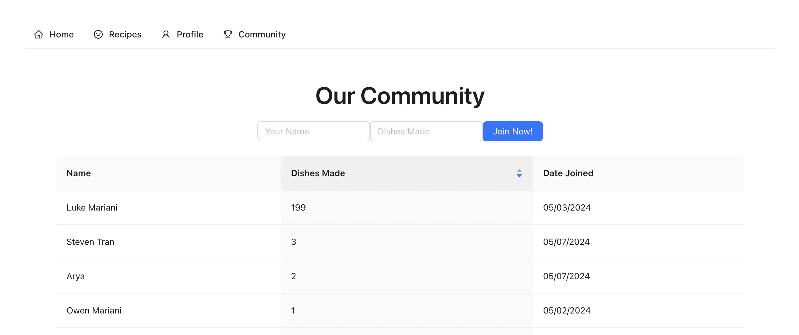

# technical-assessment
By <b>March 27th</b> you must fork this repository and submit a PR (pull request) to this repository with your completed version of the app. 

## Summary
Create an app that acts as a news directory, filtering by state and lccn. You will do this using the api listed below and creating an interesting UI to navigate the results of the API with. Similar to this:

  
<b>This was from a seperate project so the info in your table will be different</b>

It will also have a section at the bottom for users to put their emails into to join your mailing list. You should display those emails on a seperate page in a table titled "Community". You can an example of what that looks like here:

  
<b>This was from a seperate project so the info in your table will be different</b>

## Requirements
- Use a JS framework
    - If using React don't use "create-react-app" because it is deprecated
- Use a UI library (it will make it much easier on you)
- Query the Library of Congress [api endpoint](https://chroniclingamerica.loc.gov/newspapers.json) and display the results in a table
    - allow the user to filter by state and by lccn (this can be dropdowns seperate from the table)
- Have a backend to store your community members and read from it

## LLM Usage
Using LLMs for code assistance is allowed but you WILL be asked questions about your code in the interview (if invited) so you should be very comfortable with the purpose of the code.

## Submission
In order for your code to be assessed you must submit a PR by March 27th with the following
- runnable code (except the database stuff because you shouldn't have your connection uri's on github)
- a screenrecording of your code working and you explaining how you did it
- a couple sentences about how the project went

** YOU DO NOT NEED TO HAVE A 100% COMPLETE PROJECT TO SUBMIT. Please submit whatever you are able to make 

## Reflection
Working on this project was a lot of fun! I had the opportunity to work with mysql as my database of choice, which is a database I am trying to improve at, so this assessment was a nice way to learn a lot about that framework. I also used material UI for the first time, which was hard at first to figure out, but after practicing with it, I managed to get the hang of it! Overall it was a great experience that covered many of the fundamentals of creating a full-stack application!

## Link to Video
https://drive.google.com/file/d/1sY-AKfvmb8IzKi4_8lkLqA2Hur3Q2324/view